### Research Staff

**Jessie Edson** - Genetics Laboratory Manager
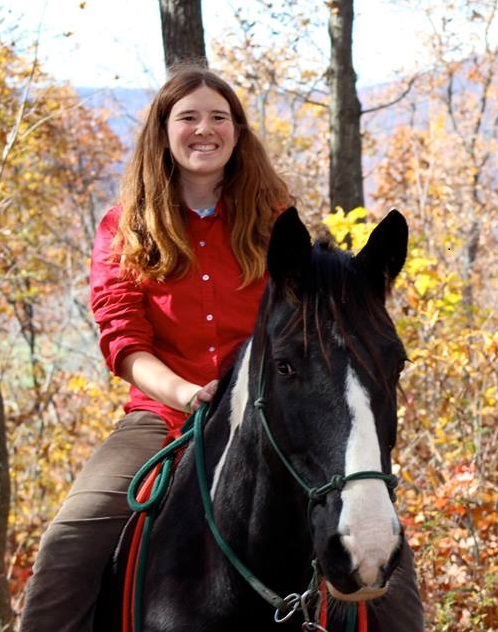

**Tyler Walters** - Field Research Support
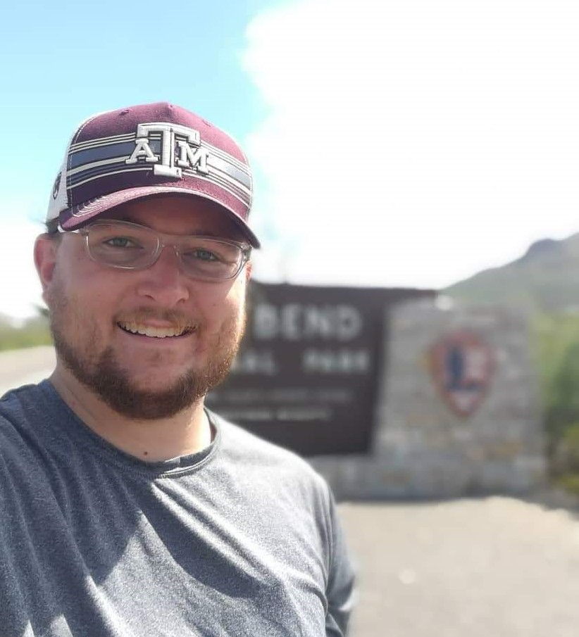

### Graduate Students

**Abby Weber** - PhD - Ecology
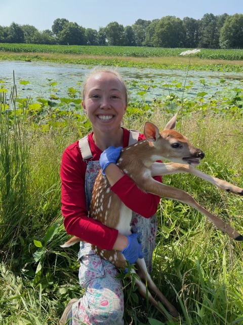

### Post Docs

**Alberto Fameli**

**Wantida (Wow) Horpiencharoen**
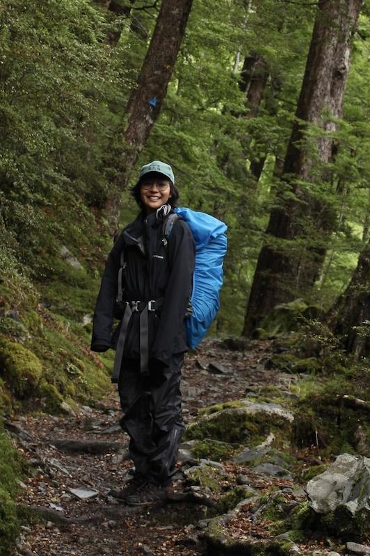

**Nate Wehr**
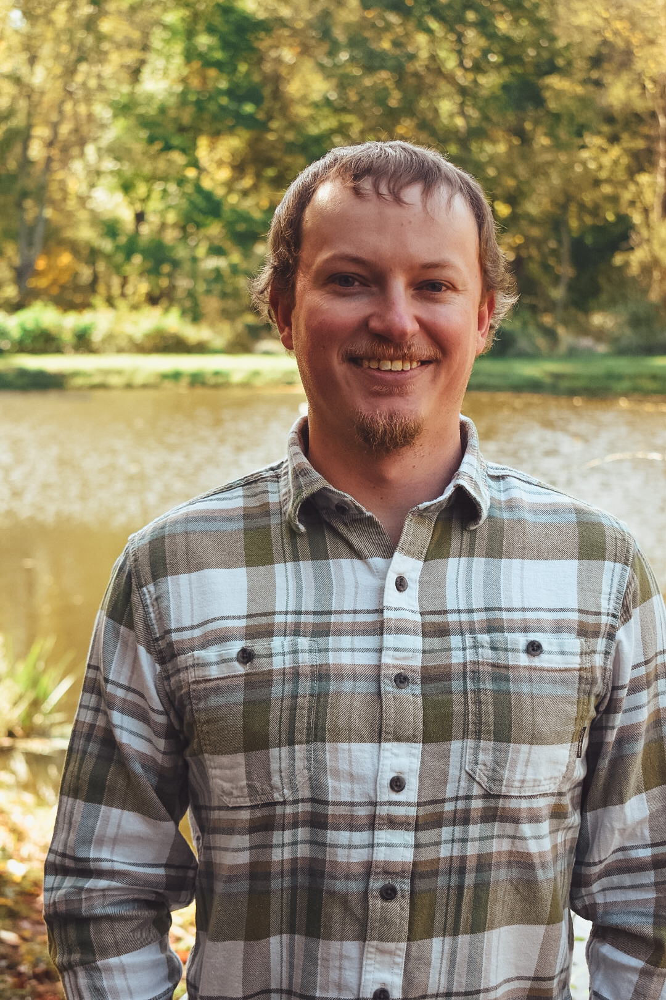

### Alumni

**Kristin Bondo** (Post doc) - Current: Research Associate at MNPRO

**Chia-Hua Lue** (Post doc) - Current: Assistant Professor, Hood College
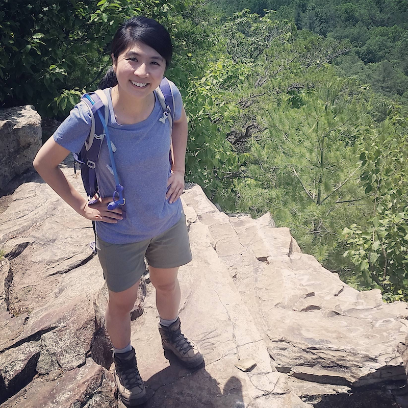

**Avery Corondi** (MS - Wildlife and Fisheries and Sciences) - Current: Elk Hollow Wildlife Consulting LLC.
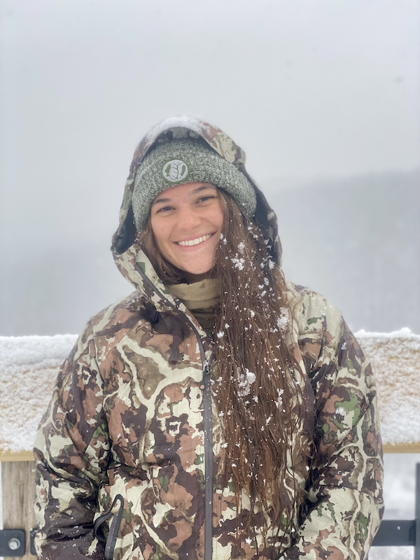

**Kelly Russo-Petrick** (Post doc)
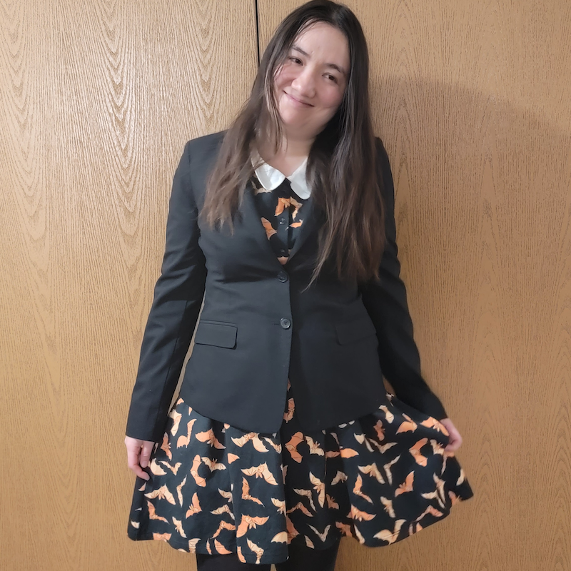

**Laken Ganoe** (MS - Wildlife and Fisheries and Sciences) - Current: Post Doc at University of Rhode Island

**Emily Carrollo** (MS - Wildlife and Fisheries and Sciences) - Current: Pantera
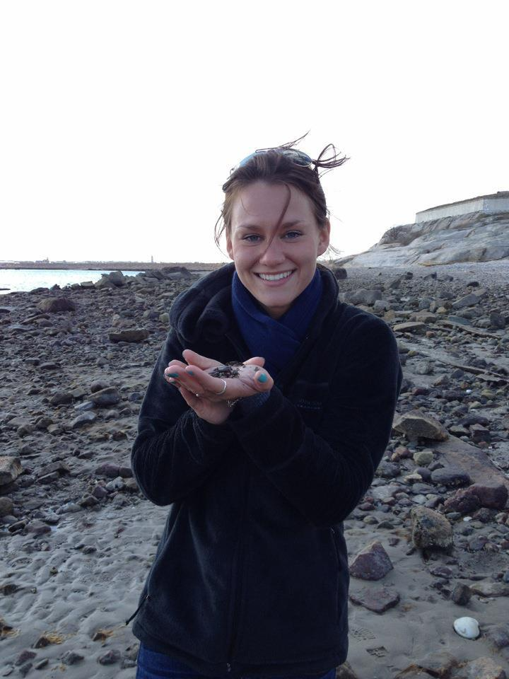

**Will Miller** (PhD - Ecology) - Current: Assistant Professor at Calvin University

**Nick Forman** (MS - Wildlife and Fisheries and Sciences) - Current: Carnivore and Small Mammal Program Manager
New Mexico Dept. of Game and Fish
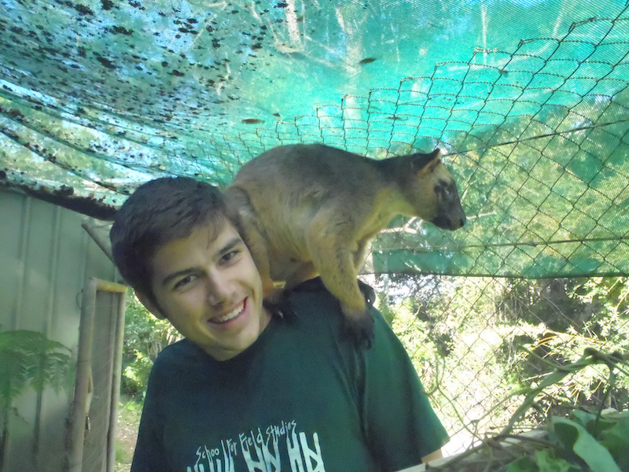

**Tyler Evans** (MS - Wildlife and Fisheries and Sciences) - Current: Recently completed PhD at Mississippi State University
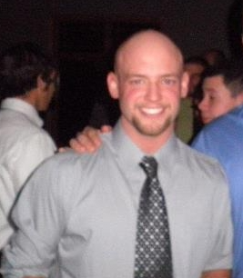
