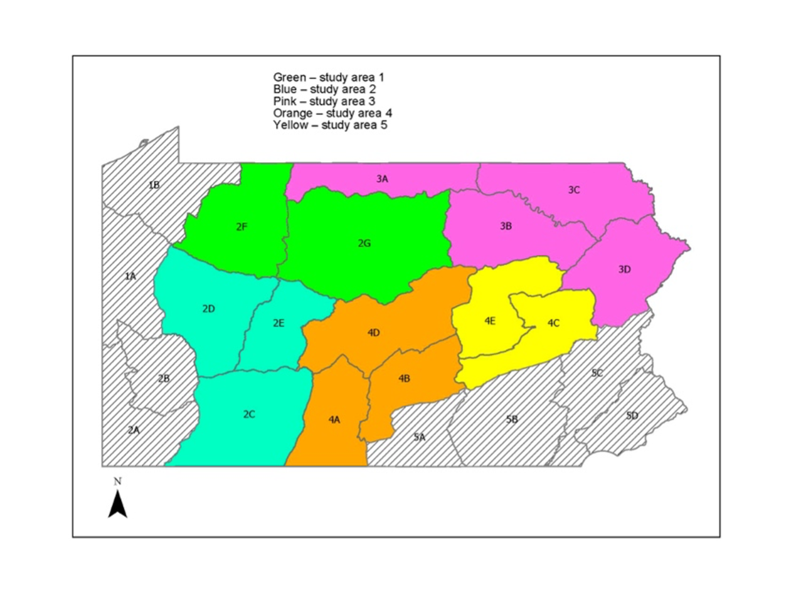
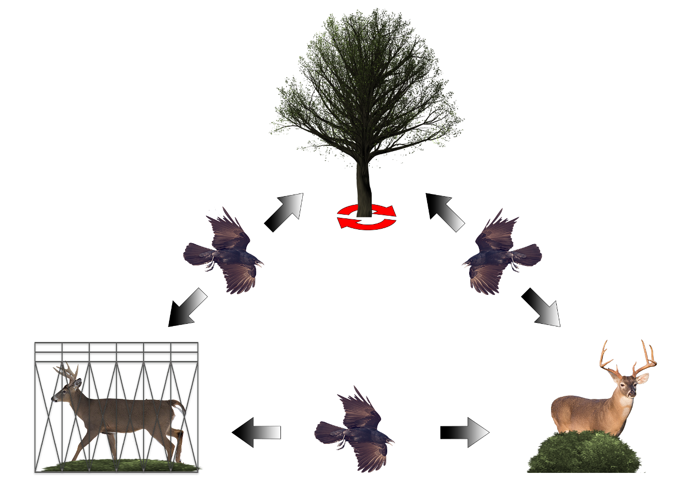
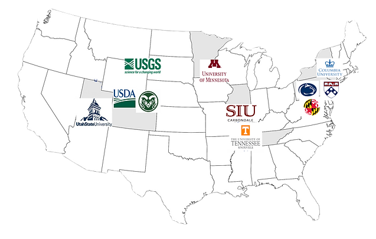

### Current Projects

Study Title: Population models to inform management of black bear statewide in Pennsylvania; Role: Co-Principal Investigator; Funding: Pennsylvania Game Commission; Dates: July 2024–June 2029; Description: A Statistical Population Reconstruction (SPR) model has been built by researchers for Pennsylvania; however, previous research indicated that additional collar data in Wildlife Management Units (WMUs) that historically have not had collared bears would benefit the model for sex-specific estimates and for population estimates at the WMU scale. Sex- and age-specific survival for black bear is not available in most areas of the state. To supplement previous efforts to collect this information and use this information in population estimates statewide using SPR models, survival data for black bear needs to be collected statewide. Capture of black bear will be initiated in summer 2024 and den captures in winters 2025-2029 statewide to provide this important information to SPRs at the WMU scale.

Study Title: Linking Genetics to Movements of White-tailed deer to Assist Surveillance for Chronic Wasting Disease; Role: Principal Investigator; Funding: U.S. Geological Survey; Dates: July 2020–present; Description: We genotyped the prion gene of individuals sampled from distinct populations of wild white-tailed deer that have experienced CWD for 10–20 years (Maryland/Pennsylvania/Virginia), an area with no current infection (New York; added in 2020), and an area with a recent infection (Ohio; added in 2022) to determine the level of CWD susceptible deer in various subpopulations throughout the region to help managers understand the potential genetic risk factors for CWD in these populations.

![Results of the Spatial Bayesian clustering algorithm for the top-ranked run using 1,557 samples (i.e. five white-tailed deer (*Odocoileus virginianus*) per sex per county), identifying: (a) maximum number of populations simulated from the posterior distribution (K=13), (b) geographic distribution of the 13 inferred clusters with black circles representing sample locations, and (c) Principal Coordinate Analysis (PCoA) showing 13 inferred clusters in ordination space with colors matching those colors used in (b)](img/msatsFigure5.png)

Study Title: Assessment of movement of prions across the captive-wild interface; Role: Principal Investigator; Funding: USDA-APHIS-Wildlife Service, National Wildlife Research Center; Dates: August 2021–present; Description: Our primary objective is to determine potential exchange of infectious prion protein material between captive cervid facilities and surrounding areas using Real-Time Quaking-Induced Conversion (RT-QuIC) assays. 

Study Title: Targeted surveillance for severe acute respiratory syndrome coronavirus 2 (SARS-CoV-2) in wildlife; Role: Principal Investigator; Funding: U.S. Department of Agriculture’s Animal and Plant Health Inspection Service under a provision of the American Rescue Plan Act; Dates: November 2022–present; Description: Severe acute respiratory syndrome coronavirus 2 (SARS-CoV-2) is the virus that causes COVID-19 in humans. There has been widespread detection of SARS-CoV-2 in North American deer but how so many deer became infected and factors that might lead to persistence of SARS-CoV-2 in deer are unclear. We are conducting coordinated, targeted surveillance in deer populations across the USA to identify risk factors of SARS-CoV-2 transmission and persistence. Our approach includes repeated testing for SARS-CoV-2 of the same numerous deer populations while tracking deer movements.

### Completed Projects

Study Title: Modeling potential habitat for pheasant population restoration; Role: Co-Principal Investigator; Funding: Pennsylvania Game Commission; Dates: July 2015–December 2017; Description: Research on Wild Pheasant Restoration Areas (WPRAs) was being conducted that provided an opportunity to evaluate models under which habitat conditions for wild pheasant populations have met established pheasant density goals based on habitat and landscape composition at the WPRAs.

Study Title: Muskrat ecology and disease; Role: Principal Investigator; Funding: Pennsylvania Game Commission; Dates: February 2016–June 2019; Description: This study was designed to investigate the survival, movements, and potential threats to muskrat.

Study Title: Landscape genetics of white-tailed deer to assess population structure for surveillance of chronic wasting disease; Role: Principal Investigator; Funding: Pennsylvania Game Commission; Dates: February 2016–June 2019; Description: We documented that widespread gene flow (FST < 1.0) and an isolation-by-distance pattern of population structure for deer that was previously undocumented in the region indicating that migration from the core area in adjacent states was likely responsible for chronic wasting disease spread to adjacent states.

Study Title: The effects of targeted removal of deer groups on the epidemiology of chronic wasting disease in wild white-tailed deer in Pennsylvania; Role: Principal Investigator; Funding: Pennsylvania Game Commission; Dates: July 2017–June 2021; Description: Potential elimination of chronic wasting disease in free-ranging deer has occurred (e.g., New York) so it might be possible to focus targeted removal efforts on locations where CWD positive animals are found at or beyond the fringe of an infected area to assess the most suitable method to decrease prevalence and minimize/eliminate transmission out of the disease management area.

Study Title: Modeling the risk of West Nile Virus to Ruffed Grouse Populations in Pennsylvania; Role: Principal Investigator; Funding: Pennsylvania Game Commission; Dates: July 2018–June 2022; Description: Our objectives are to identify the mosquito species that coexist with ruffed grouse in early successional habitat, which mosquito species are important vectors of WNV for ruffed grouse, and which environmental factors increase
the risk of WNV exposure to ruffed grouse.

Study Title: Genetic Assignment of White-Tailed Deer to Population of Origin; Role: Principal Investigator; Funding: Pennsylvania Game Commission; Dates: September 2019–June 2023; Description: Landscape genetics can provide the necessary framework to understand landscape features, dispersal characteristics of deer, and transmission and spread of CWD through assessment of population structure using genotypes of deer susceptible to disease, genetic assignment of captive and wild deer, and 11 subpopulations within the Disease Management Areas 1–3 in Pennsylvania and in Maryland/Virginia.

Study Title: Optimizing CWD surveillance: regional synthesis of demographic, spatial, and transmission-risk factors; Funding: Michigan Department of Natural Resources CWD RFP; Dates: July 2019–June 2021; Principal Investigators: Krysten Schuler (Cornell University), Sonja Christensen (Michigan State University), W. David Walter (USGS PA Coop Unit), Daniel Walsh (USGS National Wildlife Health Center), Chris Jennelle (Minnesota Department of Natural Resources), Brenda Hanley (Cornell University); Role: Co-Principal Investigator providing surveillance data from mid-Atlantic region to combine with surveillance data from mid-west to optimize surveillance of chronic wasting disease (Subaward through Cornell University).

Study Title: Optimizing CWD Surveillance: Regional Synthesis of Demographic, Spatial, and Transmission-Risk Factors; Role: Co-Principal Investigator; Funding: Cornell University; Dates: September 2019–August 2022; Description: Several modeling efforts have examined risk factors for chronic wasting disease (CWD), however, we have planned a rigorous integration of various models to derive a more powerful CWD sampling strategy.

Study Title: Parturition timing and calf survival in Pennsylvania elk; Role: Principal Investigator; Funding: Pennsylvania Game Commission; Dates: July 2020–June 2023; Description: The increase in pregnancy rates between autumn and late winter indicates asynchronous breeding in Pennsylvania elk so defining the calving season through use of vaginal implant transmitter technology and calf survival using GPS collars will identify factors that affect recruitment.

Study Title: Minnesota white-tailed deer genetics within chronic wasting disease areas; Role: Principal Investigator; Funding: Minnesota Department of Natural Resources, United States Department of Agriculture; Dates: July 2020–June 2021; Description: The objectives of this project are to conduct genetic analysis testing on wild white-tailed deer to identify shared ancestry (11 msats and mtDNA haplotypes) and susceptibility to chronic wasting disease (PRNP genotypes at codons 95, 96, 116) for deer in various regions throughout the state of Minnesota.

Study Title: Regional assessment of cause-specific mortality in white-tailed deer populations, and influence of landscape attributes and deer density on CWD spread through juvenile deer dispersal and seasonal movements (2018) Funding: NA. Dates: July 2019–June 2021; Principal Investigators: Andrew Norton, Chris Jennelle (MN Department of Natural Resources) and Daniel Walsh (USGS National Wildlife Health Center). Role: Collaborator providing GPS locations from white-tailed deer in the Mid-Atlantic Region and Lead Role in identifying definition of dispersal and risk of infection across the landscape.

Study Title: Establishing a national tissue and reagents repository for chronic wasting disease; Role: Principal Investigator; Funding: U.S. Geological Survey; Dates: September 2021–September 2023; Description: The overall goal of this project is to establish a repository of CWD field isolates from a wide-ranging geographic location in North America that will allow, for the first time, the means to begin to assess the distribution and frequency of chronic wasting disease strains in North America A14 Agent-based models to inform management of white-tailed deer for chronic wasting disease; Role: Principal Investigator; Funding: Pennsylvania Game Commission; Dates: July 2022–June 2025; Description: Objectives of this study are to compile a review of the deer behavior literature on contacts, associations, and observational data for white-tailed deer to compile sex/age-specific likelihood of contacts to inform transmission coefficients for agent-based models.
